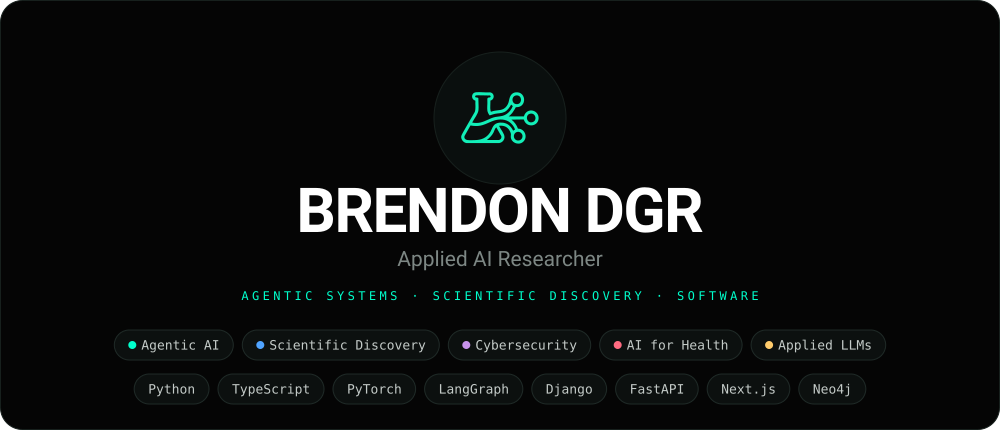
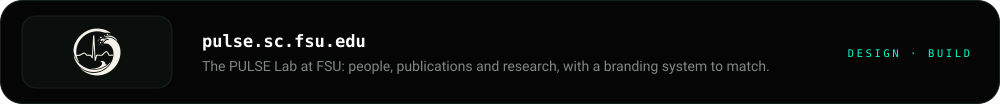
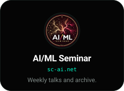

<!-- The banner, the buttons and the site cards are generated: edit tools/make_readme_art.py
     and re-run it, not the SVGs. The intro line below is a second copy of the
     site's own description; if it changes, change it there too. -->

  

  I am a PhD student in Florida State University's
  <a href="https://www.sc.fsu.edu/people?uid=bdg20b">Department of Scientific Computing</a>,
  working in the <a href="https://pulse.sc.fsu.edu/">PULSE Lab</a> on agentic AI —
  systems that plan, use tools, and carry out multi-step work on their own. 
  My interest is in pointing that at the repetitive machinery around expert work,
  starting with healthcare, so people spend their attention where it matters.

  
  &nbsp;
  
  &nbsp;
  

### Selected research

| Work | What it is | Link |
| --- | --- | --- |
| **[Mycelium](https://brendondgr.com/projects/mycelium)** | Daily research and funding intelligence for a lab: papers, grants, fellowships and deadlines, scored against what the lab actually works on. | [site](https://mycelium.brendondgr.com) |
| **Ariadne** | An agentic framework for federated cybersecurity knowledge graphs, built for quick and accurate knowledge grounding. | *WIP* |
| **Synapse** | Building hierarchical knowledge graphs through multi-agent systems grounded in research. | *WIP* |

### Selected projects

| Project | What it is | Link |
| --- | --- | --- |
| **[Mango Tree](https://brendondgr.com/projects/mango-tree)** | A self-hosted workspace of eight apps with an assistant that works across all of them, with tool access enforced in code rather than in a prompt. | [code](https://github.com/brendondgr/Mango-Tree) |
| **[Magnification](https://brendondgr.com/projects/magnification)** | A local-first job search that reads your résumé, ranks scraped postings by genuine fit, and drafts each application. | [code](https://github.com/brendondgr/Magnification) |
| **[Mytheca](https://brendondgr.com/projects/mytheca)** | A multi-agent D&D/roleplay engine: each character is its own agent, and the engine — not the model — decides what is allowed to happen. | [site](https://brendondgr.com/projects/mytheca) |
| **[Loud Radish](https://brendondgr.com/projects/loud-radish)** | Live transcription that never leaves your machine, with an assistant that answers from the transcript and cites a timestamp for every claim. | [code](https://github.com/brendondgr/Loud-Radish) |
| **[Calliope](https://brendondgr.com/projects/calliope)** | A presentation engine for decks an AI drafts and a person finishes: 31 tested layouts, 12 themes, everything editable on the slide, and WCAG AA contrast. | [site](https://brendondgr.com/projects/calliope) |

### Web & Software Development

Research is most of what I do, but not all of it. I design and build the websites
that others use & is what my software runs on. Check them out below.

  

### Currently

- **Researching** Agentic AI & Scientific Discovery in the PULSE Lab at FSU.
- **Building** larger scale projects, like Mycelium, Synapse (WIP), and Ariadne (WIP), to accomplish specific tasks accurately.
- **Interested in** retrieval that is actually measured, knowledge graphs, and keeping capable systems running on hardware you own.

  Written up properly at <a href="https://brendondgr.com/projects">brendondgr.com/projects</a>.

